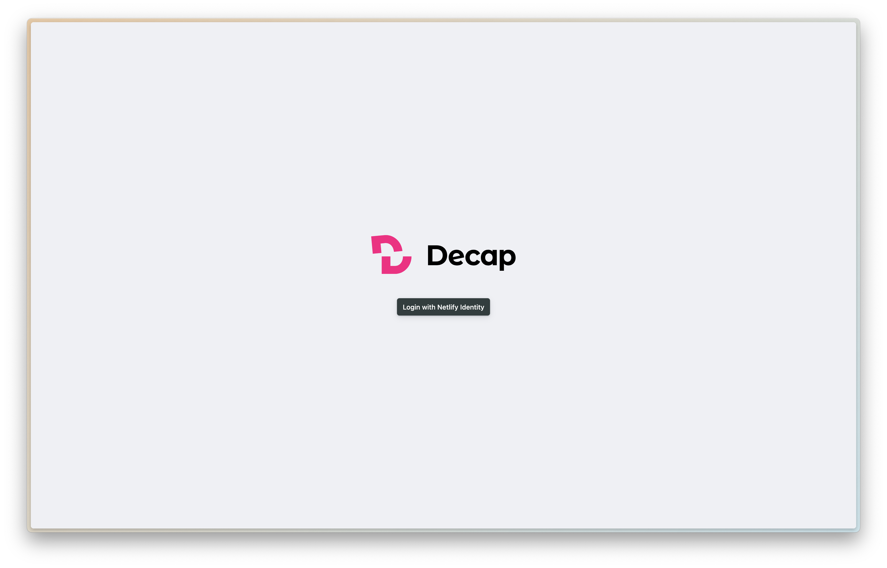
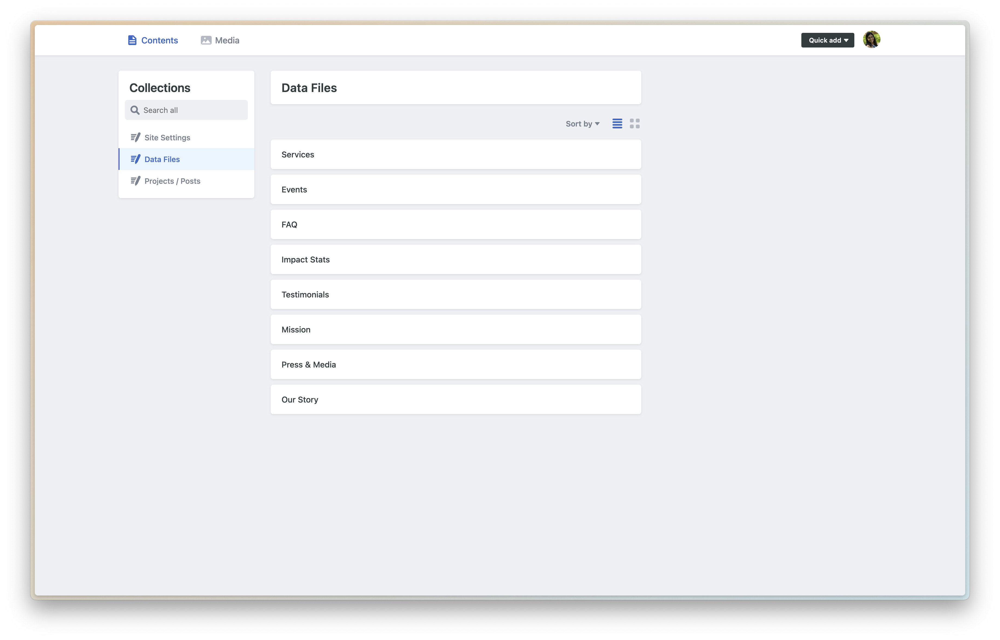
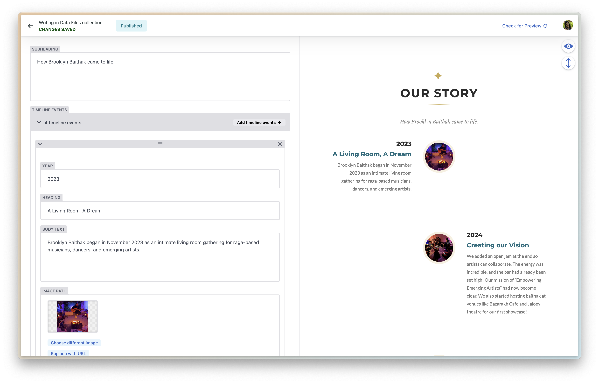
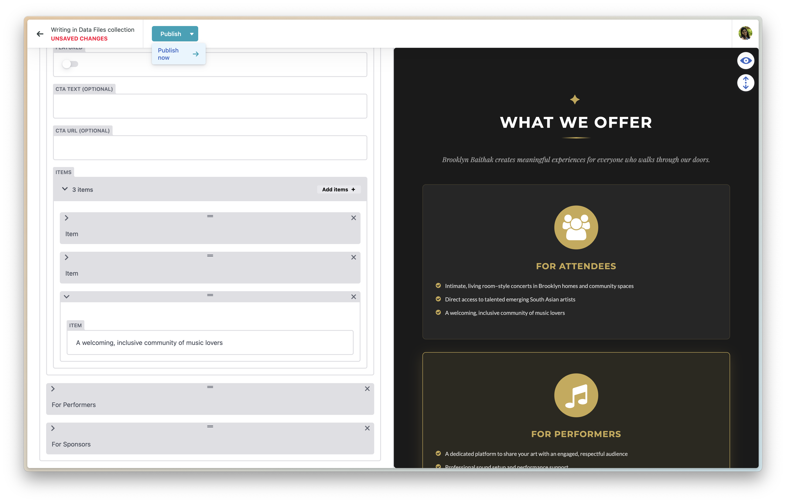

# Brooklyn Baithak - Content Contributor Guide

Welcome! This guide will show you how to easily update the content on the Brooklyn Baithak website without needing any coding knowledge. We use a Content Management System (CMS) called **Decap CMS**.

## 1. Accessing the Content Manager
1. Go to the admin page: [https://zesty-biscotti-94698d.netlify.app/admin/](https://zesty-biscotti-94698d.netlify.app/admin/)
2. You will see a login screen. Click on **Login with Netlify Identity**.
   *(Note: If you haven't been invited yet, the site administrator will need to invite you via the [Netlify Identity Dashboard](https://app.netlify.com/projects/zesty-biscotti-94698d/configuration/identity). You will receive an email with an invite link to set your password).*

> 
> *Click on the log in with netlify button and it will redirect you to authenticating with your Github account. You will need to have access to the Brooklyn Baithak Github Organization*

## 2. Navigating the Dashboard
Once logged in, you will see the CMS Dashboard. On the left sidebar, you'll find different **Collections** (categories of content):
- **Site Settings**: General website settings (Title, Description, Social Links) and Team Members.
- **Data Files**: Content for specific sections of the website (Services, Events, FAQ, Impact Stats, Testimonials, Mission, Press, Our Story).
- **Posts**: Individual projects or past events.

> 

## 3. Editing Content
1. Click on a collection on the left (e.g., **Data Files** -> **Events**).
2. You will see a list of current items. Click on an item to edit it, or click **New Event** to create a new one.
3. Fill in the required fields (Title, Date, Description, Image, etc.).
4. For text fields, you can use the rich text editor to format your text (bold, italics, links).

> 

## 4. Saving and Publishing
1. When you are done editing, look at the top bar.
2. Click **Save** to save your changes.
3. Depending on your workflow settings, you may see a **Publish** button. Click **Publish** -> **Publish Now** when you are ready for the changes to go live on the website.
4. The website will automatically rebuild behind the scenes, and your changes will be live in a couple of minutes!

> 

## Need Help?
If you run into any issues logging in, please contact the site administrator to verify your Netlify Identity access.
